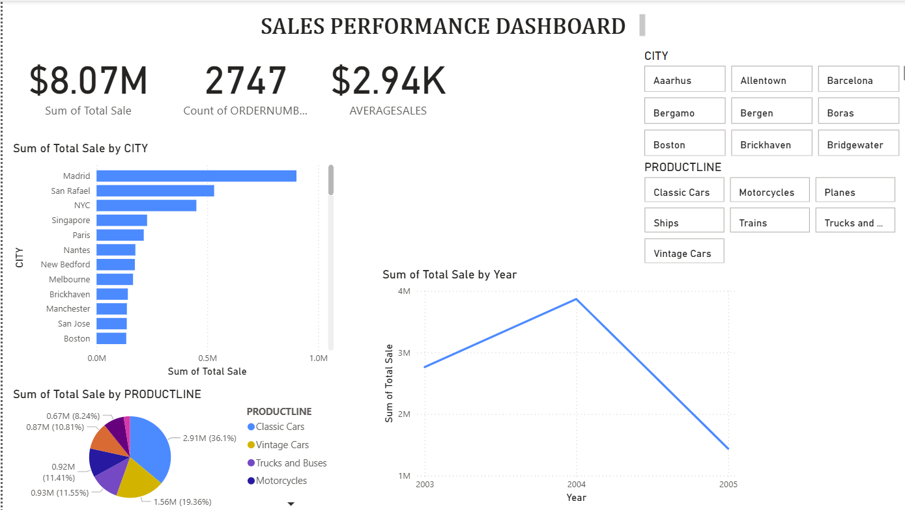
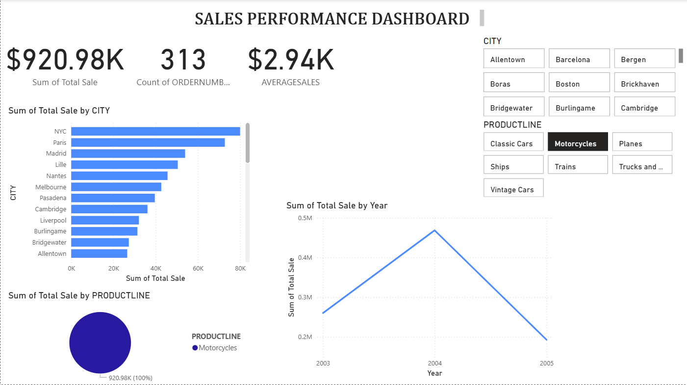

#  Sales Performance Dashboard

This project demonstrates an end-to-end data analysis workflow using **Python for data cleaning** and **Power BI for dashboarding**. It simulates a real-world sales reporting system where raw sales data is cleaned, transformed, and visualized for business insights.

---

## 🧠 Project Goals

- Clean messy sales data using Python (Pandas)
- Create business-ready visuals using Power BI
- Practice KPI design, slicers, filters, and visual storytelling
- Showcase BI skills in a portfolio-ready project

---

## 🔍 Insights Shown in Dashboard

- Total Sales (KPI Card)
- Sales by Product Category (Pie Chart)
- City Sales Performance (Bar Chart)
- Sales Over Time (Line Chart)
- Slicer to filter by City or Product

---

## 🖼️ Screenshots

### Full Dashboard View

### Sales by Product Chart

---

## 📁 How to Use

1. Clone the repo
2. Open the `.ipynb` notebook to explore the Python cleaning steps
3. Open the `.pbix` file in Power BI Desktop to explore the dashboard

---

## 💼 About the Author

Hi! I’m Prastuti Pokhrel — a self-taught Python and Power BI enthusiast.  
This is part of my professional portfolio to demonstrate real-world data skills.  
Let’s connect on [LinkedIn](https://www.linkedin.com/in/prastutipokhrel) or explore more at [GitHub](https://github.com/prastutipokhrel).

---

## ⭐️ If you like this project, feel free to star the repo!

